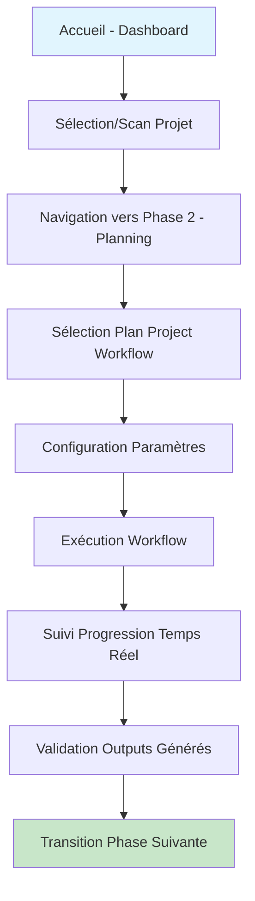
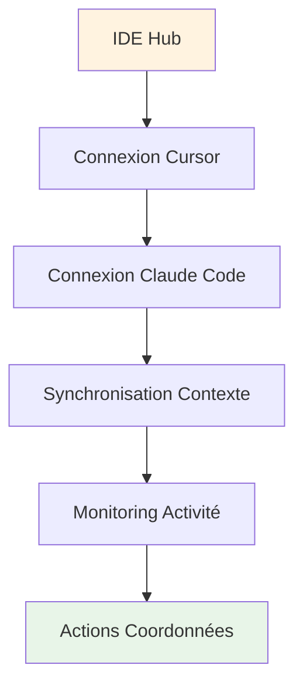
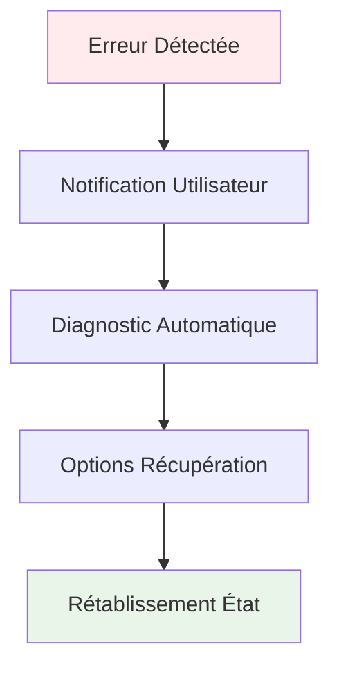

# bmad-method-perso UX/UI Specification

_Generated on 2025-10-14 by Olivier_

## Executive Summary

BMad Visual Studio est une interface web révolutionnaire qui transforme l'expérience BMad-Method v6 en une plateforme visuelle complète. Ce projet de niveau 2 (multiple features/epics) vise à créer une expérience développeur unifiée permettant d'accéder à tous les aspects de la méthodologie depuis un navigateur moderne.

**Contexte marché** : Avec la prolifération des outils d'IA modernes (Cursor, Claude Code, Gemini), les développeurs ont besoin d'une interface visuelle intuitive pour tirer pleinement parti de BMad-Method sans friction technique.

**Objectifs principaux** :

1. **Interface Unifiée** - Plateforme web complète remplaçant l'expérience CLI fragmentée
2. **Visualisation Complète** - Dashboard centralisé avec gestion visuelle des projets, workflows, agents, épics et stories
3. **Intégration Multi-IDEs** - Support natif pour Cursor, Claude Code, Gemini CLI et VS Code avec synchronisation temps réel

**Déploiement** : Application de production destinée aux développeurs expérimentés familiarisés avec BMad-Method v6 mais préférant les interfaces visuelles.

**Contraintes techniques** : Architecture React + TypeScript + Material-UI, backend Node.js + Express + SQLite, intégration multi-IDEs via API REST et Server-Sent Events.

---

## 1. UX Goals and Principles

### 1.1 Target User Personas

**Persona Principal : Développeur BMad-Method Expérimenté**

- **Nom** : Alex, Développeur Full-Stack Senior
- **Âge** : 28-45 ans
- **Expérience** : 5+ années de développement, maîtrise BMad-Method v6
- **Objectifs** : Accélérer les workflows de développement, réduire la friction entre outils, maintenir la productivité
- **Douleurs** : Basculement constant entre CLI et interfaces, perte de contexte, manque de visualisation globale
- **Comportements** : Utilise plusieurs IDEs simultanément, recherche l'efficacité maximale, préfère les interfaces visuelles intuitives

**Persona Secondaire : Équipe de Développement Collaborative**

- **Nom** : Sarah, Tech Lead / Scrum Master
- **Âge** : 30-50 ans
- **Expérience** : Management d'équipe, coordination de projets complexes
- **Objectifs** : Améliorer la visibilité des projets, faciliter l'onboarding, standardiser les processus
- **Douleurs** : Difficulté à suivre l'avancement, manque d'outils de coordination visuelle, formation coûteuse
- **Comportements** : Recherche des outils qui améliorent la collaboration, valorise l'efficacité d'équipe

**Contexte d'usage** : Environnements de développement professionnel avec équipes distribuées, projets complexes nécessitant coordination multi-outils.

### 1.2 Usability Goals

**1. Facilité d'Apprentissage (Learnability)**

- Nouvel utilisateur capable d'accomplir une tâche basique en < 5 minutes
- Découverte progressive des fonctionnalités avancées
- Interface auto-explicative réduisant le besoin de documentation

**2. Efficacité pour Utilisateurs Experts (Efficiency)**

- Raccourcis clavier pour toutes les actions principales
- Navigation rapide entre sections via recherche globale
- Personnalisation de l'interface selon les préférences utilisateur
- Workflow parallèles pour utilisateurs expérimentés

**3. Prévention d'Erreurs (Error Prevention)**

- Validation en temps réel des paramètres de workflow
- Confirmation explicite pour actions destructives
- États visuels clairs pour statut des opérations
- Récupération facile des erreurs utilisateur

**4. Accessibilité Universelle (Accessibility)**

- Conformité WCAG 2.1 AA minimum
- Support complet navigation clavier
- Contraste élevé et options de personnalisation visuelle
- Compatibilité avec technologies d'assistance (lecteurs d'écran)

**5. Satisfaction Utilisateur (Satisfaction)**

- Interface engageante favorisant l'adoption
- Feedback positif pour actions réussies
- Réduction de la frustration cognitive
- Sentiment de contrôle et de maîtrise

### 1.3 Design Principles

**1. Simplicité Progressive Avancée**

- Interface épurée masquant la complexité sous-jacente
- Découverte progressive des fonctionnalités avancées
- Réduction cognitive maximale pour tâches courantes

**2. Feedback Immédiat et Contextuel**

- Retour visuel instantané pour toute interaction utilisateur
- Indicateurs de progression pour opérations longues
- Messages d'erreur constructifs avec solutions suggérées

**3. Cohérence Méthodologique BMad**

- Terminologie alignée avec les 4 phases BMad-Method
- Patterns d'interaction familiers pour utilisateurs existants
- Respect des conventions établies tout en innovant

**4. Accessibilité par Défaut**

- Design inclusif dès la conception initiale
- Options de personnalisation avancées pour besoins spécifiques
- Performance optimisée pour tous les utilisateurs

**5. Performance Visuelle Optimisée**

- Animations fluides et intentionnelles uniquement
- États de chargement élégants réduisant la perception d'attente
- Transitions logiques entre états d'interface

---

## 2. Information Architecture

### 2.1 Site Map

```
BMad Visual Studio
├── Dashboard (Accueil)
│   ├── Métriques principales
│   ├── Workflows actifs
│   ├── Stories en cours
│   ├── Santé projet globale
│   └── Actions rapides
├── Phase 1 - Analysis
│   ├── Document Project
│   ├── Research
│   ├── Product Brief
│   ├── Game Brief (si applicable)
│   └── Brainstorming
├── Phase 2 - Planning
│   ├── Plan Project (PRD)
│   ├── UX Specification
│   ├── Tech Specification
│   ├── Narrative Design (si jeu)
│   └── GDD (si jeu)
├── Phase 3 - Solutioning
│   ├── Solution Architecture
│   ├── Tech Specs détaillés
│   └── Architecture Components
├── Phase 4 - Implementation
│   ├── Create Story
│   ├── Story Ready
│   ├── Story Context
│   ├── Dev Story
│   └── Story Approved
├── Projects
│   ├── Liste des projets
│   ├── Sélection contexte actif
│   ├── Configuration projet
│   └── Scan automatique
├── Agents
│   ├── Découverte agents
│   ├── Activation/Désactivation
│   ├── Configuration paramètres
│   └── Contrôle visuel
├── IDE Hub
│   ├── Connexions Cursor
│   ├── Connexions Claude Code
│   ├── Connexions Gemini CLI
│   ├── Connexions VS Code
│   └── Monitoring synchronisation
└── Settings
    ├── Préférences utilisateur
    ├── Configuration globale
    ├── Gestion des connexions
    └── Paramètres système
```

### 2.2 Navigation Structure

**Navigation Principale (Header)**

- Logo BMad Visual Studio (cliquable vers Dashboard)
- Sélecteur de projet actif (dropdown avec projets disponibles)
- Recherche globale (recherche workflows, agents, projets)
- Navigation par phases (4 onglets principaux)
- IDE Hub (icône avec statut connexions)
- User menu (avatar, paramètres, déconnexion)

**Navigation Secondaire (Sidebar/Left Panel)**

- Dashboard (vue d'ensemble)
- Phase 1 - Analysis (workflows d'analyse)
- Phase 2 - Planning (PRD, UX, Tech Spec)
- Phase 3 - Solutioning (architecture, specs détaillés)
- Phase 4 - Implementation (stories, développement)
- Projects (gestion des projets)
- Agents (contrôle des agents)
- Settings (configuration)

**Navigation Contextuelle (Breadcrumbs)**

- Dashboard > Phase X > Workflow spécifique
- Projet actif affiché dans header
- Indicateur de progression dans workflow

**Navigation Mobile**

- Menu hamburger dans header
- Navigation principale réduite à icônes
- Recherche accessible depuis menu
- Bottom navigation pour accès rapide aux phases

**Navigation par Raccourcis Clavier**

- Ctrl/Cmd + K : Recherche globale
- Ctrl/Cmd + 1-4 : Accès direct aux phases
- Ctrl/Cmd + P : Sélecteur de projet
- Ctrl/Cmd + A : Gestion des agents
- Ctrl/Cmd + , : Paramètres

---

## 3. User Flows

### 3.1 Primary User Journey: Planifier et exécuter un workflow BMad-Method

**Contexte utilisateur** : Développeur expérimenté travaillant sur un projet web brownfield, familiarisé avec BMad-Method mais préférant une interface visuelle.



**Étapes détaillées :**

1. **Découverte (A → B)**
   - Utilisateur arrive sur dashboard avec métriques projets actifs
   - Sélection automatique du dernier projet utilisé ou choix manuel
   - Scan automatique des projets BMad disponibles

2. **Navigation Contextuelle (B → C)**
   - Interface organisée par phases BMad-Method
   - Sélection intuitive de "Phase 2 - Planning"
   - Affichage workflows disponibles avec descriptions

3. **Configuration Workflow (C → E)**
   - Sélection "plan-project" avec pré-remplissage paramètres
   - Validation niveau 2, type web, brownfield détecté automatiquement
   - Options de personnalisation visibles mais non requises

4. **Exécution Guidée (E → G)**
   - Démarrage workflow avec indicateur progression temps réel
   - Feedback visuel pour chaque étape (PRD, épics, validation)
   - Possibilité d'ajustement paramètres en cours d'exécution

5. **Validation et Transition (G → I)**
   - Revue outputs générés avec possibilité modification
   - Transition automatique vers phase suivante (solutioning)
   - Mise à jour statut projet et métriques

**Points de Décision Critiques :**

- Sélection projet actif (automatique vs manuel)
- Personnalisation paramètres workflow avancés
- Validation outputs avant finalisation

---

### 3.2 Secondary User Journey: Gestion Multi-IDEs

**Contexte utilisateur** : Développeur utilisant plusieurs environnements de développement simultanément.



**Étapes détaillées :**

1. **Connexions Multiples (A → C)**
   - Interface dédiée aux connexions IDE
   - Configuration indépendante par IDE
   - Statut connexion temps réel

2. **Synchronisation Contextuelle (C → D)**
   - Partage automatique contexte projet entre IDEs
   - Propagation événements (nouveau workflow, changement statut)
   - Cohérence données entre environnements

3. **Monitoring Unifié (D → E)**
   - Vue centralisée activité tous IDEs
   - Alertes synchronisation et conflits
   - Métriques performance par IDE

---

### 3.3 Error Recovery Journey

**Contexte utilisateur** : Gestion d'erreurs et récupération workflow.



**Étapes détaillées :**

1. **Détection Proactive (A → B)**
   - Surveillance continue opérations
   - Alertes visuelles non intrusives
   - Context d'erreur préservé

2. **Diagnostic Intelligent (B → C)**
   - Analyse automatique cause erreur
   - Suggestions récupération contextuelles
   - Historique erreurs similaire

3. **Récupération Guidée (C → E)**
   - Options récupération classées par probabilité succès
   - Rétablissement état avec confirmation utilisateur
   - Prévention récurrence erreur identifiée

---

## 4. Component Library and Design System

### 4.1 Design System Approach

**Approche Hybride Material-UI + Composants Personnalisés**

**Fondation : Material-UI (MUI)**

- Utilisation de Material-UI v5 comme base solide et éprouvée
- Thème personnalisé adapté à l'identité BMad-Method
- Composants de base cohérents et accessibles par défaut

**Extensions Personnalisées**

- Composants spécialisés BMad-Method (WorkflowCard, PhaseNavigation, AgentToggle)
- Composants de visualisation (MetricsChart, ProgressIndicator, StatusBadge)
- Composants d'interaction avancés (MultiStepWizard, ContextSelector)

**Hiérarchie des Composants (Atomic Design)**

- **Atomes** : Boutons MUI, Icônes, Typography, Inputs de base
- **Molécules** : Cards, Formulaires, Navigation items, Status indicators
- **Organismes** : Dashboard layout, Workflow interface, Project selector
- **Templates** : Pages complètes (Dashboard, Project view, Workflow execution)
- **Pages** : Applications entières avec navigation

**Gouvernance**

- Composants documentés avec Storybook pour développement/démo
- Tests automatisés pour composants critiques
- Guidelines d'utilisation avec dos/don'ts
- Process de contribution et validation des nouveaux composants

### 4.2 Core Components

**Composants de Navigation**

- **PhaseNavigation** : Onglets des 4 phases avec indicateurs de progression
- **ProjectSelector** : Dropdown avec projets actifs et statut
- **Breadcrumb** : Fil d'Ariane contextuel avec navigation rapide
- **Sidebar** : Menu latéral collapsible avec recherche intégrée

**Composants de Dashboard**

- **MetricsCard** : Carte avec métriques clés (workflows actifs, stories, santé projet)
- **ActivityFeed** : Flux d'activité temps réel avec événements SSE
- **QuickActions** : Actions contextuelles basées sur l'état projet
- **ProgressChart** : Graphique de progression par phases

**Composants de Workflow**

- **WorkflowCard** : Carte représentant un workflow avec statut et actions
- **WorkflowWizard** : Interface étape par étape pour exécution workflows
- **ParameterForm** : Formulaire dynamique de configuration workflow
- **ProgressIndicator** : Barre de progression avec étapes détaillées

**Composants d'Agents**

- **AgentToggle** : Switch pour activation/désactivation agents
- **AgentCard** : Carte d'agent avec statut et paramètres
- **AgentConfigPanel** : Panneau de configuration avancée des agents

**Composants IDE Hub**

- **IDEConnectionCard** : Carte de connexion IDE avec statut et contrôles
- **SyncStatusIndicator** : Indicateur de synchronisation temps réel
- **MultiIDEActivityFeed** : Flux d'activité coordonné entre IDEs

**Composants de Feedback**

- **ToastNotification** : Notifications non intrusives avec actions
- **ErrorBoundary** : Gestion d'erreurs avec récupération utilisateur
- **LoadingSkeleton** : Squelettes de chargement pour états transitoires
- **ConfirmationDialog** : Dialogues de confirmation pour actions critiques

**États et Variants pour Chaque Composant**

- **États** : Default, Hover, Active, Disabled, Error, Loading
- **Variants** : Primary, Secondary, Success, Warning, Danger, Info
- **Tailles** : Small, Medium, Large
- **Modes** : Light, Dark (suivant préférences système)

---

## 5. Visual Design Foundation

### 5.1 Color Palette

**Palette Primaire (BMad-Method)**

- **Primary Blue** : #1976d2 (Actions principales, navigation active)
- **Primary Light** : #e3f2fd (Fonds sélectionnés, accents subtils)
- **Primary Dark** : #0d47a1 (Contraste élevé, textes importants)

**Palette Secondaire (Succès/Progression)**

- **Success Green** : #4caf50 (Actions réussies, progression positive)
- **Success Light** : #e8f5e8 (Fonds de succès, indicateurs positifs)
- **Warning Orange** : #ff9800 (Avertissements, attention requise)

**Palette d'États**

- **Error Red** : #f44336 (Erreurs, actions destructives)
- **Info Blue** : #2196f3 (Informations, aide contextuelle)
- **Neutral Grey** : #757575 (Textes secondaires, bordures)

**Palette BMad-Method Spécifique**

- **Phase Analysis** : #9c27b0 (Violet - Recherche et analyse)
- **Phase Planning** : #ff5722 (Orange - Planification et spécifications)
- **Phase Solutioning** : #607d8b (Bleu-gris - Architecture et conception)
- **Phase Implementation** : #4caf50 (Vert - Développement et déploiement)

**Couleurs de Surface**

- **Background** : #fafafa (Fond principal)
- **Surface** : #ffffff (Cartes, panneaux)
- **Surface Variant** : #f5f5f5 (Variations de surface)

**Utilisation Sémantique**

- **Texte Primaire** : #212121 (Contraste élevé)
- **Texte Secondaire** : #757575 (Informations complémentaires)
- **Bordures** : #e0e0e0 (Séparations subtiles)
- **Diviseurs** : #bdbdbd (Séparations plus marquées)

### 5.2 Typography

**Font Families:**

- **Primary** : Inter (Web moderne, excellente lisibilité)
- **Fallback** : -apple-system, BlinkMacSystemFont, 'Segoe UI', system-ui (Système natif)
- **Monospace** : 'JetBrains Mono', 'Fira Code', Consolas (Code et données techniques)

**Raison du choix Inter** :

- Optimisée pour interfaces web modernes
- Excellente lisibilité sur écrans
- Support étendu des langues et caractères
- Métriques cohérentes pour design système

**Type Scale:**

- **Display Large** : 57px / 64px line-height (Titres de section principaux)
- **Display Medium** : 45px / 52px line-height (Titres de page)
- **Display Small** : 36px / 44px line-height (Sous-titres majeurs)
- **Headline Large** : 32px / 40px line-height (Titres de cartes)
- **Headline Medium** : 28px / 36px line-height (Sous-titres)
- **Headline Small** : 24px / 32px line-height (Titres de composants)
- **Title Large** : 22px / 28px line-height (Labels importants)
- **Title Medium** : 16px / 24px line-height (Labels de formulaire)
- **Title Small** : 14px / 20px line-height (Métadonnées)
- **Body Large** : 16px / 24px line-height (Texte principal)
- **Body Medium** : 14px / 20px line-height (Texte secondaire)
- **Body Small** : 12px / 16px line-height (Captions, métadonnées)
- **Label Large** : 14px / 20px line-height (Boutons, navigation)
- **Label Medium** : 12px / 16px line-height (Badges, indicateurs)
- **Label Small** : 11px / 16px line-height (Annotations)

### 5.3 Spacing and Layout

**Grille de Base**

- **Unité de base** : 4px (permet alignements précis)
- **Grille principale** : 8px (multiples de l'unité de base)
- **Grille de contenu** : 16px (espacement confortable pour lecture)

**Échelle d'Espacement**

- **XS** : 4px (Bords fins, séparations minimes)
- **SM** : 8px (Espaces entre éléments rapprochés)
- **MD** : 16px (Espacement standard entre composants)
- **LG** : 24px (Séparation entre sections majeures)
- **XL** : 32px (Espaces généreux pour respiration)
- **XXL** : 48px (Séparations importantes)

**Grille Responsive**

- **Mobile** : 4 colonnes maximum (320px+)
- **Tablet** : 8 colonnes (768px+)
- **Desktop** : 12 colonnes (1024px+)
- **Large Desktop** : 16 colonnes (1440px+)

**Marge et Padding Standards**

- **Container padding** : 16px (mobile) → 24px (desktop)
- **Card padding** : 16px (compact) → 24px (confortable)
- **Section spacing** : 32px (mobile) → 48px (desktop)
- **Component gaps** : 8px (dense) → 16px (aéré)

**Layout Patterns**

- **Single column** : Mobile-first avec empilement vertical
- **Two column** : Sidebar + contenu principal
- **Three column** : Navigation + contenu + panneau contextuel
- **Grid layouts** : Cards, métriques, listes d'éléments

**Breakpoints Alignés**

- **Mobile** : < 768px
- **Tablet** : 768px - 1023px
- **Desktop** : 1024px - 1439px
- **Large Desktop** : ≥ 1440px

---

## 6. Responsive Design

### 6.1 Breakpoints

**Breakpoints Détaillés**

- **XS** : 0px - 599px (Mobile portrait)
- **SM** : 600px - 767px (Mobile landscape / petite tablette)
- **MD** : 768px - 1023px (Tablette)
- **LG** : 1024px - 1439px (Desktop standard)
- **XL** : 1440px - 1919px (Grand desktop)
- **XXL** : ≥ 1920px (Très grand écran / multi-écrans)

**Points d'Inflexion Critiques**

- **Navigation** : 768px (passage sidebar → hamburger menu)
- **Layout** : 1024px (passage single → multi-colonnes)
- **Densité** : 1440px (augmentation espacement et taille éléments)

### 6.2 Adaptation Patterns

**Mobile-First Patterns (XS-SM)**

- **Navigation** : Menu hamburger avec recherche intégrée
- **Layout** : Empilement vertical strict, full-width components
- **Interactions** : Touch-optimized (boutons 44px minimum)
- **Contenu** : Priorisation verticale, scroll naturel

**Tablet Patterns (MD)**

- **Navigation** : Menu latéral réduit ou bottom navigation
- **Layout** : Introduction colonnes secondaires pour informations contextuelles
- **Interactions** : Support souris et tactile
- **Contenu** : Équilibre entre densité et lisibilité

**Desktop Patterns (LG+)**

- **Navigation** : Sidebar complète avec recherche globale
- **Layout** : Multi-colonnes avec panneaux contextuels
- **Interactions** : Optimisé souris/clavier avec raccourcis
- **Contenu** : Maximisation espace avec informations riches

**Large Desktop Patterns (XL+)**

- **Navigation** : Sidebar étendue avec outils avancés
- **Layout** : Workspaces multiples, vues divisées
- **Interactions** : Multi-tâches avancées, raccourcis étendus
- **Contenu** : Informations détaillées, vues d'ensemble étendues

**Adaptive Components**

- **Cards** : Compact mobile → détaillé desktop
- **Tables** : Scroll horizontal mobile → colonnes visibles desktop
- **Forms** : Single-colonne mobile → multi-colonnes desktop
- **Charts** : Simplifié mobile → détaillé desktop

---

## 7. Accessibility

### 7.1 Compliance Target

**Niveau WCAG 2.1 AA Minimum**

- Conformité complète aux critères de succès niveau AA
- Support Section 508 pour administrations publiques
- Préparation pour WCAG 2.2 avec critères émergents

**Métriques d'Accessibilité**

- **Contraste** : Minimum 4.5:1 pour texte normal, 3:1 pour texte large
- **Taille cible** : Tous éléments interactifs ≥ 44px
- **Navigation clavier** : 100% fonctionnalités accessibles au clavier
- **Lecteur d'écran** : Support complet ARIA labels et rôles

### 7.2 Key Requirements

**Navigation et Interaction**

- **Tab order logique** : Séquence de tabulation intuitive et complète
- **Focus visible** : Indicateur de focus clair sur tous éléments
- **Échap pour sortie** : Touche Échap ferme modales et menus
- **Entrée/Space activation** : Actions cohérentes sur éléments interactifs

**Contenu et Présentation**

- **Texte alternatif** : Descriptions significatives pour toutes images
- **Headings structurés** : Hiérarchie H1-H6 logique et complète
- **Langue déclarée** : Attribut lang correct sur éléments
- **Réduction mouvement** : Respect préférence système pour animations

**Formulaires et Saisie**

- **Labels explicites** : Chaque champ associé à un label visible
- **Messages d'erreur** : Erreurs annoncées et liées aux champs concernés
- **États requis** : Indicateurs visuels clairs pour champs obligatoires
- **Validation temps réel** : Feedback immédiat avec suggestions

**Support Technologique**

- **Lecteurs d'écran** : Compatibilité NVDA, JAWS, VoiceOver
- **Navigation clavier seule** : 100% fonctionnalités sans souris
- **Zoom 200%** : Interface utilisable à 200% zoom
- **Contraste élevé** : Mode contraste élevé fonctionnel

**Tests et Validation**

- **Audit automatique** : Outils comme axe-core intégrés
- **Tests manuels** : Vérification avec lecteur d'écran
- **Tests utilisateurs** : Validation avec utilisateurs handicapés
- **Monitoring continu** : Régression accessibility dans CI/CD

---

## 8. Interaction and Motion

### 8.1 Motion Principles

**1. Intentionnel et Significatif**

- Chaque animation a un objectif clair (guidage, feedback, célébration)
- Évite les animations décoratives qui distraient de la tâche
- Mouvement utilisé pour renforcer la hiérarchie informationnelle

**2. Fluide et Naturel**

- Transitions avec easing curves biologiques (ease-out-dominant)
- Durée adaptée à la distance parcourue (plus long = plus lent)
- Respect des préférences système "reduce motion"

**3. Cohérent et Prévisible**

- Patterns d'animation répétés pour interactions similaires
- Timing cohérent (200-300ms pour micro-interactions)
- Direction logique (gauche→droite pour progression, haut→bas pour révélation)

**4. Accessible et Inclusif**

- Animations peuvent être désactivées via préférences système
- Évite les animations qui pourraient déclencher des crises (flash, vibrations rapides)
- Transitions suffisamment lentes pour suivi oculaire aisé

**5. Performance-Optimisé**

- Animations CSS-native plutôt que JavaScript quand possible
- GPU-accelerated pour fluidité sur tous appareils
- Arrêt automatique pendant scroll pour préserver performance

### 8.2 Key Animations

**Micro-Interactions Utilisateur**

- **Bouton Hover** : Scale subtil (1.05x) + couleur d'accent
- **Focus Ring** : Animation d'apparition en fade-in (200ms)
- **Success Feedback** : Checkmark avec bounce célébration
- **Error State** : Shake horizontal léger + couleur rouge

**Transitions de Navigation**

- **Page Load** : Fade-in du contenu principal (300ms)
- **Tab Switch** : Slide horizontal entre vues (250ms)
- **Modal Open** : Scale + fade-in du backdrop (200ms)
- **Menu Expand** : Slide-down du contenu (300ms ease-out)

**Animations de Progression**

- **Workflow Steps** : Slide horizontal avec indicateur progression
- **Loading States** : Skeleton loading avec pulse subtil
- **Data Updates** : Fade-in des nouvelles données (150ms)
- **Status Changes** : Couleur transition pour statut updates

**Animations Contextuelles**

- **Tooltip Reveal** : Fade-in vers le bas depuis trigger
- **Dropdown Expand** : Scale-down vers le haut depuis header
- **Card Hover** : Élève légère (4px) + ombre portée
- **Search Results** : Stagger animation pour liste résultats

**Animations Système**

- **Notifications** : Slide-in depuis droite, auto-dismiss
- **Progress Bars** : Smooth fill animation avec célébration completion
- **Skeleton Loading** : Wave animation pour éléments en chargement
- **Error Recovery** : Fade-in solutions avec actions suggérées

---

## 9. Design Files and Wireframes

### 9.1 Design Files

**Approche de Design**

- **Outil principal** : Figma (collaboration temps réel, prototypage avancé)
- **Structure** : Un fichier maître avec pages par section (Dashboard, Phases, Components)
- **Composants** : Bibliothèque partagée avec variants et états documentés
- **Prototypage** : Liens interactifs pour user flows principaux

**Fichiers Design**

- **BMad_Visual_Studio_Design_System.fig** : Composants de base et styles
- **BMad_Visual_Studio_Dashboard.fig** : Layouts du tableau de bord
- **BMad_Visual_Studio_Workflows.fig** : Interfaces d'exécution de workflows
- **BMad_Visual_Studio_Components.fig** : Bibliothèque complète de composants

**Guidelines d'Utilisation**

- Couleurs définies avec styles partagés (pas de hardcoding)
- Composants avec auto-layout pour responsive
- Prototypes avec interactions réalistes
- Documentation inline avec commentaires

### 9.2 Key Screen Layouts

**Layout 1 : Dashboard Principal (Desktop)**

```
┌─────────────────────────────────────────────────────────────────┐
│ 🎯 BMad Visual Studio                    [👤 User] [⚙️ Settings] │
├─────────────────────────────────────────────────────────────────┤
│ ┌──────────────┬─────────────────────────────────────────────┐ │
│ │ 📁 Projects  │ ┌─────────────────────────────────────────┐ │ │
│ │ • Project A  │ │ 🚀 Dashboard Principal                  │ │ │
│ │ • Project B  │ │ • Workflows actifs: 3                   │ │ │
│ │              │ │ • Stories en cours: 7                   │ │ │
│ │ 🔍 Search    │ │ • Santé projet: 🟢 Excellent            │ │ │
│ │ IDEs         │ └─────────────────────────────────────────┘ │ │ │
│ │ • Cursor     │                                             │ │ │
│ │ • Claude     │ ┌─────────────────────────────────────────┐ │ │ │
│ │ • VS Code    │ │ 🎯 Quick Actions                        │ │ │
│ └──────────────┘ │ • ▶️ Démarrer workflow                   │ │ │
│                  └─────────────────────────────────────────┘ │ │ │
└─────────────────────────────────────────────────────────────────┘
```

**Layout 2 : Interface Workflow (Desktop)**

```
┌─────────────────────────────────────────────────────────────────┐
│ 🎯 BMad Visual Studio > Phase 2 - Planning > Plan Project       │
├─────────────────────────────────────────────────────────────────┤
│ ┌─────────────────────────────────────────────────────────────┐ │
│ │ 📋 Workflow: plan-project                                   │ │
│ │ Status: 🔄 En cours                    Progress: ███ 60%     │ │ │
│ │ Step 3/5: Generate Epics                                    │ │ │
│ ├─────────────────────────────────────────────────────────────┤ │ │
│ │ 📝 Étape actuelle                                           │ │ │
│ │ Génération de la structure d'epics basée sur le PRD...     │ │ │
│ │                                                             │ │ │
│ │ 📊 Paramètres actuels                                       │ │ │
│ │ • Niveau projet: 2                                          │ │ │
│ │ • Type projet: web                                          │ │ │
│ │ • Field type: brownfield                                    │ │ │
│ └─────────────────────────────────────────────────────────────┘ │ │
└─────────────────────────────────────────────────────────────────┘
```

**Layout 3 : Vue Mobile (Smartphone)**

```
┌─────────────────────────────────────┐
│ 🎯 BMad VS    [☰] [👤] [⚙️]         │
├─────────────────────────────────────┤
│ 📊 Dashboard                        │
│                                     │
│ • Workflows: 3 actifs              │
│ • Stories: 7 en cours              │
│ • Santé: 🟢 Excellent              │
│                                     │
│ 🎯 Actions rapides                  │
│ ▶️ Nouveau workflow                 │
│ 🤖 Gérer agents                     │
│ 📁 Projets                          │
│                                     │
│ 📈 Activité récente                 │
│ • PRD généré (2 min ago)            │
│ • Workflow terminé (5 min ago)     │
│ • Agent activé (10 min ago)        │
└─────────────────────────────────────┘
```

**Composants Clés Documentés**

- **MetricsCard** : Layout responsive avec icône, valeur, label
- **WorkflowCard** : État visuel, actions contextuelles, métadonnées
- **PhaseNavigation** : Indicateurs progression, navigation directe
- **ProjectSelector** : Recherche, statut projet, sélection rapide

---

## 10. Next Steps

### 10.1 Immediate Actions

**Phase de Développement Immediate**

1. **Configuration Design System**
   - Installer et configurer Material-UI v5 avec thème personnalisé
   - Créer composants de base (atoms) dans Storybook
   - Définir palette couleurs et typographie dans thème

2. **Développement Composants Core**
   - Implémenter composants de navigation (PhaseNavigation, Sidebar)
   - Créer composants de dashboard (MetricsCard, ActivityFeed)
   - Développer composants de workflow (WorkflowCard, ProgressIndicator)

3. **Layout Principal**
   - Implémenter layout responsive avec sidebar et header
   - Intégrer système de routage React
   - Ajouter navigation par phases avec indicateurs

4. **Intégration Backend**
   - Connecter API REST pour projets et workflows
   - Implémenter Server-Sent Events pour activité temps réel
   - Ajouter gestion d'état Redux pour données

5. **Tests et Validation**
   - Tests unitaires composants avec React Testing Library
   - Tests d'intégration avec données mockées
   - Validation accessibilité avec outils automatisés

### 10.2 Design Handoff Checklist

**Spécifications Techniques**

- [ ] Design system documenté et implémenté
- [ ] Composants avec props et états définis
- [ ] Guidelines d'utilisation documentées
- [ ] Breakpoints et responsive définis

**Composants Clés**

- [ ] Navigation principale implémentée
- [ ] Dashboard avec métriques fonctionnelles
- [ ] Interface workflow opérationnelle
- [ ] Gestion agents avec contrôles visuels

**Expérience Utilisateur**

- [ ] User flows principaux implémentés
- [ ] Gestion erreurs avec récupération utilisateur
- [ ] Feedback utilisateur pour toutes actions
- [ ] Accessibilité WCAG 2.1 AA validée

**Performance et Qualité**

- [ ] Animations optimisées et accessibles
- [ ] Interface responsive sur tous breakpoints
- [ ] Temps de chargement < 2s sur 3G
- [ ] Tests automatisés couvrant 80% composants

**Intégration**

- [ ] Connexions IDE fonctionnelles
- [ ] Synchronisation temps réel opérationnelle
- [ ] Gestion projets et workflows complète
- [ ] API backend entièrement intégrée

**Documentation**

- [ ] Guide développeur pour composants
- [ ] Documentation Storybook complète
- [ ] Guide d'utilisation pour utilisateurs finaux
- [ ] Procédures déploiement et maintenance

**UX Validation**

- [ ] Tests utilisateurs avec personas cibles
- [ ] Métriques utilisabilité mesurées
- [ ] Retours intégrés pour amélioration continue
- [ ] Formation équipe sur principes UX

---

## Appendix

### Related Documents

- PRD: `PRD.md`
- Epics: `epics.md`
- Tech Spec: `tech-spec.md`
- Architecture: `solution-architecture.md`

### Version History

| Date       | Version | Changes               | Author  |
| ---------- | ------- | --------------------- | ------- |
| 2025-10-14 | 1.0     | Initial specification | Olivier |
